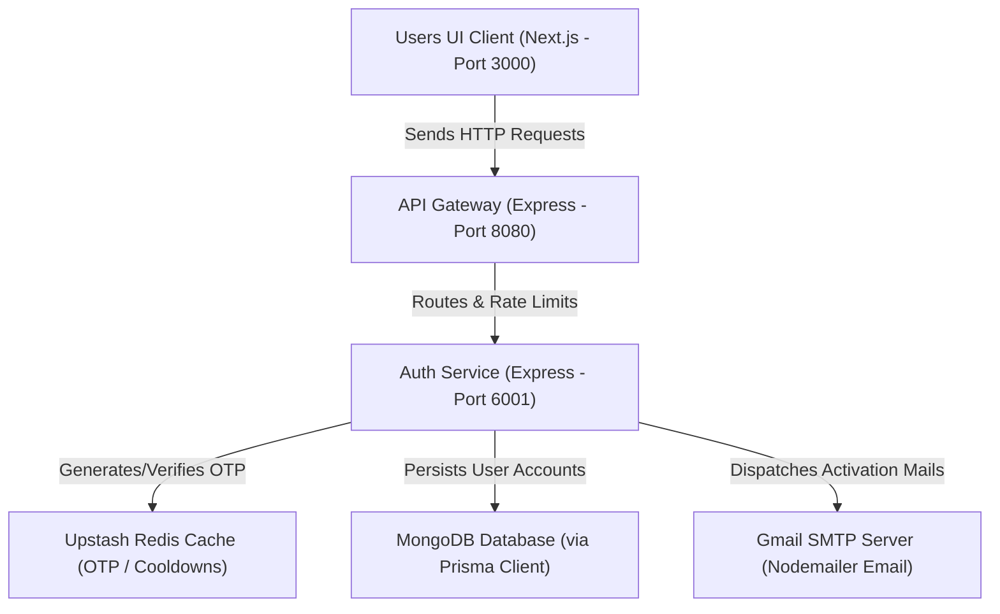

# 🛒 Estore Backend

A microservices-based backend for an E-commerce platform, built using the [Nx](https://nx.dev) monorepo toolchain.

## 🏗️ Architecture

This project uses a microservices architecture to manage different domains of the e-commerce platform efficiently.

### Request Flow Diagram



### Current Services

1. **API Gateway (`api-gateway`)** - Port **8080**
   - Serves as the single entry point for all client requests.
   - Configured with CORS, rate limiting, and will handle request proxying to internal microservices.
2. **Auth Service (`auth-service`)** - Port **6001**
   - Dedicated microservice to handle user authentication, user accounts, and authorization logic.
3. **Users UI (`users-ui`)** - Port **3000**
   - Frontend application built with Next.js (App Router), React, and Tailwind CSS.

## 🛠️ Tech Stack

- **Frontend:** Next.js (App Router), React, Tailwind CSS
- **Backend Frameworks:** Node.js, Express.js
- **Database & Cache:** MongoDB (via Prisma ORM), Redis (Upstash)
- **Language:** TypeScript
- **Monorepo Management:** Nx
- **Bundling:** Webpack, esbuild
- **Testing:** Jest

## 🚀 Getting Started

### Prerequisites
- Node.js (v20+)
- npm

### Installation

1. Clone the repository and navigate into the directory
2. Install dependencies:
   ```sh
   npm install
   ```

### Running the Environment Local

You can start all microservices concurrently using the existing root script:

```sh
npm run dev
```
*This command leverages `nx run-many` to boot the API Gateway and Auth Service in development mode, watching for changes.*

### Running Individual Services

If you only want to focus on a single service, you can run:

```sh
npx nx serve api-gateway
```
or 
```sh
npx nx serve auth-service
```

## 🧪 Testing

To run unit tests across all projects:

```sh
npx nx run-many -t test
```

## 📦 Production Builds

To build all apps for production:

```sh
npx nx run-many -t build
```
The compiled output will be available in the `dist/` directory.
